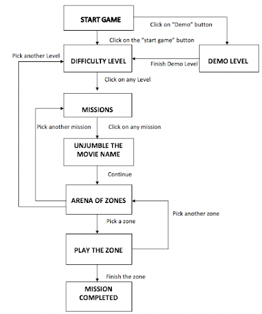
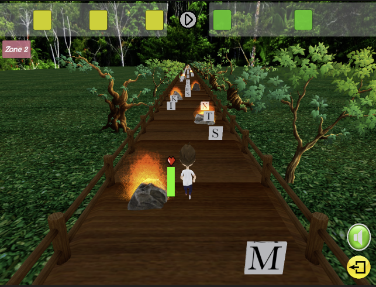
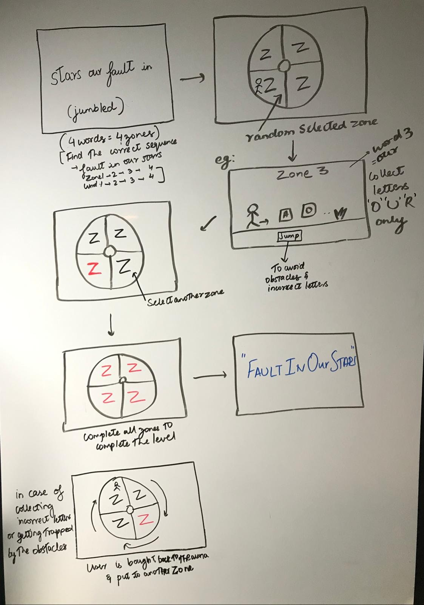
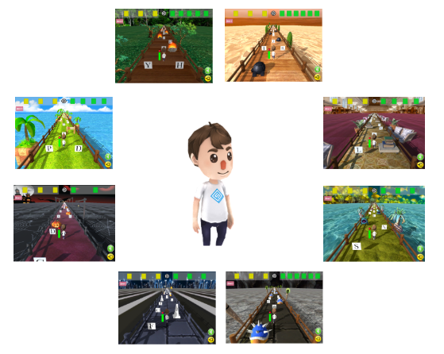
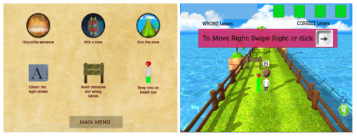
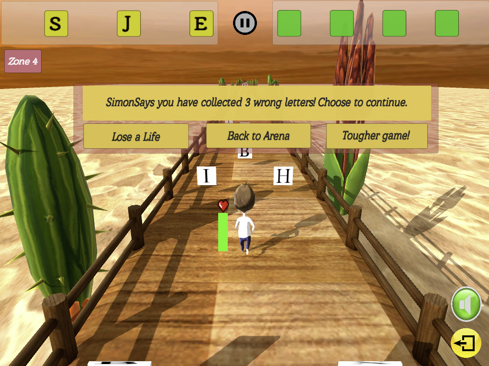

# SimonSays

## 1. Game Overview

**Genre:** Word Puzzle and Platform Game 

Links : https://simon-says.itch.io/simonsayscsci526 (Web Consoles) and https://simmer.io/@SimonSaysGame/simonsaysfinalcsci526 (Mobile devices)

**Elevator Pitch:** 
SimonSays is a 3D single player platformer game that aims to bring together elements of word puzzle coupled with action packed tasks that the player must complete in order to win . The player is initially presented with a list of words in a jumbled fashion which has to be decoded and put back in the right order to make sense. Think this is easy? But SimonSays otherwise!

Once the player rearranges the words in the right order, he/she has to then enter an arena comprising various zones. Here, each word from the player’s decoded list maps to a particular zone. Each zone also contains all the letters of the alphabet which the player can use to form the word he/she is looking for. In addition, these zones are fraught with many obstacles that the player has to overcome in the journey of collecting the letters to spell the word! The catch here is, if the player collides with the obstacles many times or collects incorrect letters, it upsets Simon who stops the progress of the player in that zone and provides him multiple options as to what the player wants to do next. Each option comes with its own challenges which the player has to overcome to finish the game!

**Goal:**
Player is initially presented with a list of jumbled words. The player has to find the correct order of words before entering the arena. After entering a chosen zone, the player's goal is to collect all the letters that form the word which is supposed to be placed in that position while avoiding obstacles in that zone. After collecting all the words in corresponding positions, the player is able to get the right sequence of words.

*For Example:* The Stars In Fault Our -> jumbled order.
*Player has to decode the right sequence of words:* The Fault In Our Stars
Player enters the arena containing multiple zones, 5 zones in this example. When a zone is selected and entered, the zone number is given. If for example, the entered zone is zone 5, the player has to collect only the letters S,T,A,R,S (in any order) to form the word “STARS” which falls in 5th position of the unjumbled sentence while avoiding the obstacles present in that zone. 

**Games Played:**
- Hangman
- Wheel of Fortune
- Subway surfer
- Temple Run

## 2. Game Design

**Objectives:**
- Unjumble a given movie name to form the correct order within the given timeframe.
- Choose a zone of a particular word of the sentence and collect all the letters of that word in the zone while avoiding obstacles and incorrect letters.
- In a similar fashion, complete all the zones in that level to finish the mission.

**Game Loop:**

### Game Flow:

**Overall Game Flow:**
- Click on the level of difficulty among
    1. Easy
    2. Medium
    3. Hard
    4. Extreme

- Each difficulty level has 5 missions. Click to choose one among them.
- Each mission contains a jumbled movie name that needs to be unjumbled to get the right order by clicking and swapping tiles.
- Once unjumbled, the arena of zones appears. Click on any zone mapped to a particular word.
- Play the zone.
- Finish all the zones in the area to complete the particular mission.

**Game Flow of Each Zone:**
- Click a zone to start collecting the right letters.
- Keep tabs on the health bar to avoid losing all 3 lives by bumping into obstacles.
- If more than 3 incorrect letters are collected, pick a choice among
    1. Losing a life
    2. Back to arena
    3. Tougher game
- Finish the zone and move on to the next.

## 3. Mechanics and Interface

**Mechanics:**
1. Movement :
    - For Mobile Phones: Swipe Left to move left, swipe right to move right. Swipe up to jump.
    - For Console: Press left arrow key to move left, right arrow key to move right. Press up arrow key or spacebar to jump.
2. Goal:
    Collect letters to form the correct word in the appropriate zones and avoid obstacles.
3. Math:
    - Placement of letters randomized with random number generation.
    - Patterns of zones shuffled dynamically.

**UI Elements:**
- Instruction Screen
- Game Demo
- Pause/Play button
- Panel of right letters collected
- Panel of wrong letters collected
- Health bar
- Mute/Unmute button
- Quit button

**Game Sketch:**

## 4. Improvements Adopted

**New Zones:**
There were 4 different zones until the midterms, and 4 more new zones were added. Now the 8 zones of the game are themed - Beach, Desert, City, Cave, Forest, Halloween, Library, Underwater.

**Demo Level and Instruction Screen:**
Based on the feedback received after midterm, a concise instruction screen and an elaborate, detailed demo level were created. 

**New Levels and Missions:**
Based on feedback received from peers, 4 new levels and 5 new missions in each level were introduced.

**Display Panel for Correct and Incorrect Letters:**
Added two panels, Correct Letter Panel (Green) which displays correct letters collected by the player in the right sequence and Incorrect Letter Panel (Yellow) which displays upto three incorrect letters collected (the player gets a buffer of 3 wrong letters, after which the player is presented with the new choices : 5th improvement)

**New Choices to the Player:**
Added more choices to the player by providing him with options and layed out logic for a tougher game, where more incorrect letters (tough letters) are introduced in the zone to make it more challenging. 

**Completion of Mission :**
After the player wins a zone and is brought back to the arena, the zone is marked as completed. Upon completion of all the zones in the mission, Simon celebrates the player’s victory. 

**Sound Effects:**
All the zones were added with sound effects including BGM and click button sound for all the menu buttons.

## 5. Team Members

- Abdulwahab Mohammed A Alothaim
- Akhila Sreedhar
- Ashi Ranka
- Chaitra Mudradi
- Chakrika Aishwarya
- Damini Cousik
- Samipya Nirmal
- Spoorti Nidagundi
